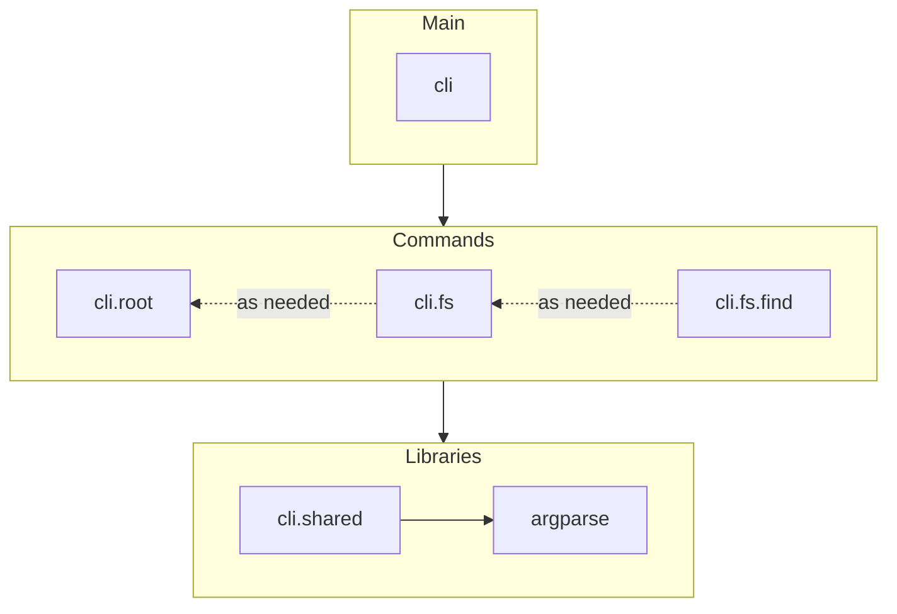
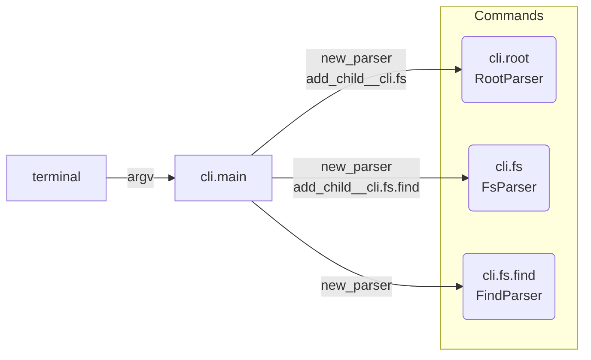
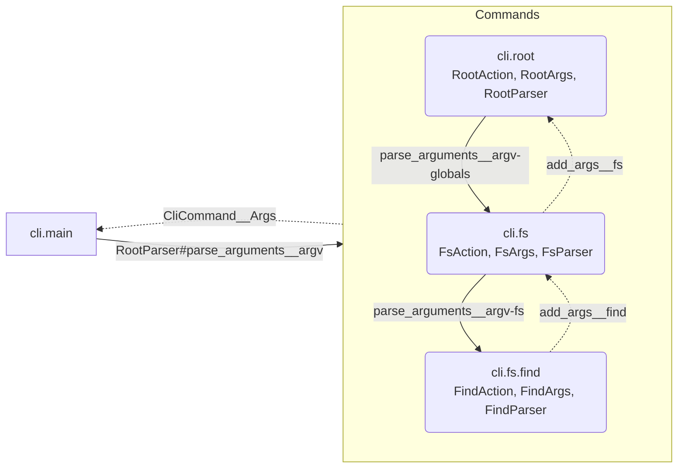
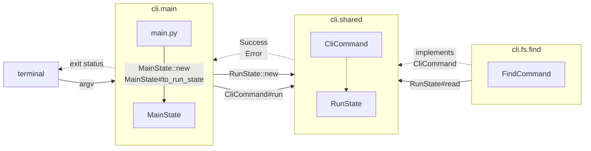

# Code Structure

## Principles

1. Adding a new (sub-)command should not require modifying any other command's code.
2. A separate main package is responsible for creation, wiring, and orchestration.  It is the only
   package that may depend upon-and have code references to-everything else.
3. ~~All code for parsing and running each (sub-)command should be in its own package, to group
   together code that has the same reasons to change (e.g. package by feature).~~

   _Note: Delegating logic to configure argparse to another package is proving to be difficult.  Try
   doing it all from main for now.  Maybe there will be a way to delegate some of that behavior
   later._

## Package dependencies

Packages are structured as follows, to orient dependencies in the necessary manner:

Arrows represent code references from one package to another.

## Workflow

### 01: main creates parsers

`main` makes a `Parser` for each command and then links them together, so that each parser can reach
child parsers for (sub-)commands.

### 02: parse arguments

`main` passes arguments to the root parser, which delegates to child parsers to parse (sub-)command
arguments and decide upon which operation(s) to process.

This results in either a `CliCommand` that performs the indicated operation (valid arguments) or an
error (invalid arguments).  The command has access to all arguments: its own, as well as any
affecting global behavior (e.g. verbose output).

### 03: run command and exit

`main` constructs a state in which to run commands, which contains any dependencies (e.g. services
or I/O) the command needs to run.  It uses environment variables and/or arguments to override
default configuration.

It then uses this state to run the `CliCommand`.  The command returns a result that is either
success or an error, and main determines and exits with a suitable status code.

